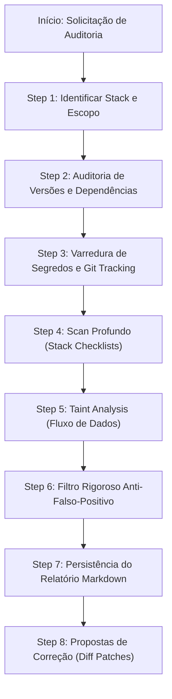

# Auditoria de Código e Segurança Multi-Stack

Scanner orientado a **pesquisador de segurança defensiva**: analisa o contexto real da aplicação, o fluxo de dados ponta a ponta e as defesas nativas do framework na versão exata instalada — sem alarmismos teóricos ou suposições genéricas.

**Idioma do relatório:** Português do Brasil (nomenclaturas OWASP, CVE, CWE e terminologias de código preservadas no original).

---

## 🛡️ Princípios Fundamentais (Invioláveis)

1. **Versão Instalada > Última Lançada:** Inspecione lockfiles (`pom.xml`, `pubspec.lock`, `package-lock.json`, `pnpm-lock.yaml`, `yarn.lock`, `requirements.txt`). "Existe versão mais nova" é estritamente **INFO**, a menos que haja um CVE ou advisory (GHSA/OSV) documentado e explorável no caso de uso do projeto.
2. **Evidência Real > Alarme Falso:** Nunca sinalize uma falha apenas pela menção de um método ou classe. Avalie sanitização, validação de beans/schemas, permissões de contexto e parametrização no caminho de execução.
3. **Contexto Arquitetural e de Domínio:** Diferencie limitações legítimas de ambiente de negligência de segurança:
   - Em IoT / Redes Locais: certificados autoassinados em LAN privada ou tráfego HTTP local de Smart TVs são inerentes aos protocolos dos fabricantes.
   - Em APIs Web Corporativas: falta de validação em DTOs ou queries concatenadas são falhas severas.
4. **Rastreamento de Fluxo de Dados (Taint Analysis):**
   `Origem Externa / Entrada ➔ Validação / Sanitização ➔ Lógica de Negócio ➔ Armazenamento / Execução ➔ Saída / Resposta`
5. **Filtro Anti-Falso-Positivo Obrigatório:** Todo achado preliminar deve passar pelos critérios de descarte antes de integrar o sumário executivo.
6. **Patches Apenas como Propostas:** Nenhuma linha de código em produção deve ser alterada automaticamente durante a auditoria. Correções são exibidas em formato diff (`before / after`) para aprovação do desenvolvedor.
7. **Persistência Obrigatória do Relatório:** Todo scan completo deve salvar uma cópia em arquivo Markdown no projeto e resumir os achados na conversa.

---

## 📋 Fluxo de Execução em 8 Passos



### Step 1 — Detecção de Escopo e Stack
1. Se um caminho específico for fornecido (`/auditoria-codigo src/main/java`), restrinja a busca a ele. Do contrário, audite a raiz do repositório.
2. Identifique as tecnologias ativas consultando os manifestos e arquivos de build:
   - **Backend Java/JVM:** `pom.xml` ou `build.gradle` (Spring Boot, Java version, Jakarta vs Javax, JPA, Flyway).
   - **Mobile / Flutter:** `pubspec.yaml` e `pubspec.lock` (Flutter SDK, plugins de rede, sockets, storage).
   - **Frontend Web:** `package.json` / lockfile (React, Next.js, Vite, TypeScript, Axios/Zod).
   - **Python / APIs:** `requirements.txt`, `pyproject.toml` ou `Pipfile`.
   - **Infraestrutura Local:** `docker-compose.yml`, `Dockerfile`, manifests de plataforma (`AndroidManifest.xml`, configurações de desktop).

### Step 2 — Auditoria de Dependências e CVEs Reais
- **Node.js:** `npm audit --omit=dev`
- **Flutter / Dart:** `dart pub outdated` confrontado com banco de vulnerabilidades (`osv.dev` / GitHub Advisory).
- **Java / Maven:** Inspecionar `pom.xml` contra CVEs conhecidas em bibliotecas de parsing/mapeamento (Jackson, ModelMapper, etc.).
- Dependências exclusivas de `test` ou `provided` não devem ser classificadas como `CRITICAL` ou `HIGH` a menos que comprometam o runtime ou a esteira de build.

### Step 3 — Varredura de Segredos e Rastreamento no Git
1. Executar inspeção via `git ls-files` para checar se arquivos sensíveis estão sendo rastreados:
   - Certificados e chaves: `*.pem`, `*.key`, `*.jks`, `*.keystore`, `*.p12`.
   - Arquivos de credenciais: `.env*`, `secrets.json`, `google-services.json`, `credentials.json`.
2. Varrer código fonte e arquivos de configuração (`application*.properties`, `application*.yml`, `docker-compose.yml`):
   - Chaves privadas ou tokens estáticos hardcoded no código.
   - Diferenciar credenciais locais de desenvolvimento (ex: senhas triviais em container MySQL local de teste) de chaves de nuvem ou segredos de produção.

### Step 4 — Scan Profundo Especializado (Módulos de Auditoria)
Acione os checklists correspondentes à stack identificada:

#### A. Backend & APIs Corporativas (Spring Boot / Java)
- **Injeção de Código / SQL:** Concatenação em `@Query` ou `EntityManager.createQuery`, native queries cruas, SpEL injection.
- **Mass Assignment (Over-Posting):** Entidades JPA expostas diretamente em `@RequestBody`, DTOs aceitando `id` ou datas de sistema em criação/edição.
- **Autorização & IDOR / BOLA:** Mutações por ID (`@PathVariable id`, `@DeleteMapping`, `/ativo`) sem checagem de perfil/proprietário da sessão.
- **Vazamento de Dados:** Handlers (`ApiExceptionHandler`) expondo stack traces ou nomes de tabelas/constraints do banco (RFC 7807).
- **Tipagem & Integridade de Negócio:** Manipulação de valores monetários com tipos de ponto flutuante (`double`/`float`) em vez de `BigDecimal`; mutações sem anotação `@Transactional`.
- **Validação de Entrada:** Ausência de `@Valid` em endpoints REST.

#### B. Mobile, IoT & Protocolos Locais (Flutter / Dart)
- **Comunicação de Rede / WebSockets:** Validação de certificados TLS em rede local (`badCertificateCallback` validando se o host é IP privado `192.168.x.x` / `10.x.x.x`), sanitização com `try-catch` em `jsonDecode`.
- **UDP / SSDP / Wake-on-LAN:** Fechamento explícito de sockets UDP (`socket.close()`), timeouts para evitar consumo excessivo de bateria, validação de formato de MAC Address por regex antes do disparo de pacotes mágicos.
- **Storage Local:** Chaves críticas de sessão e tokens de cliente salvos em texto puro em `SharedPreferences` vs `flutter_secure_storage`.
- **Permissões de Plataforma:** `AndroidManifest.xml` (`usesCleartextTraffic` documentado para portas de TVs locais, `exported="false"` em componentes não públicos, ausência de permissões desnecessárias).

#### C. Frontend Web (React / TypeScript / Next.js)
- **Cross-Site Scripting (XSS):** Uso de `dangerouslySetInnerHTML` sem sanitização via DOMPurify, injeção em atributos de URL (`javascript:`).
- **Exposição em Bundles:** Variáveis públicas (`VITE_*`, `NEXT_PUBLIC_*`) contendo tokens privados/chaves mestras.
- **Gerenciamento de Sessão:** Armazenamento de JWT em `localStorage` sujeito a furto via XSS vs cookies `HttpOnly` com `SameSite`.

### Step 5 — Rastreamento de Fluxo de Dados (Taint Analysis)
Para cada ponto de entrada externo:
- A entrada é validada e tipada estritamente?
- Quem pode executar a requisição?
- Os dados alcançam o banco de dados parametrizados?
- A resposta esconde detalhes internos do servidor e campos protegidos?

### Step 6 — Filtro Anti-Falso-Positivo
Confronte todo achado com as regras de descarte:
- Queries derivadas no Spring Data JPA (`findByAno`) usam `PreparedStatement` nativo. Não é SQLi.
- Swagger UI / SpringDoc ativo em ambiente local é ferramenta de desenvolvimento. Rebaixar para `INFO`.
- Dados mockados em fixtures de seed (`afterMigrate.sql`) são legítimos. Não são vazamentos.
- Classes em diretórios de teste (`src/test/java`, `test/`) não devem ser auditadas com regras de produção.
- `usesCleartextTraffic="true"` para protocolos locais em portas HTTP/WS de Smart TVs (ex: Samsung porta 8001) é restrição do hardware da TV.
- Certificado autoassinado em TV local na porta 3001 é o padrão de firmware da LG. Falha real é aceitar fora de faixas de IP privado.
- `VITE_API_URL` apontando para o backend é parâmetro público, não segredo vazado.

### Step 7 — Persistência do Relatório Markdown
Gere o relatório estruturado e **salve-o obrigatoriamente no repositório**:
- Se houver diretório `docs/`: salvar em `docs/security/audits/YYYY-MM-DD-auditoria.md` (ou `YYYY-MM-DD_HHmm-auditoria.md` se houver mais de uma no dia).
- Caso contrário: salvar em `.agents/skills/security-audit/reports/YYYY-MM-DD-auditoria.md`.

### Step 8 — Propostas de Correção (Patches Sugeridos)
Para cada achado classificado como **CRITICAL** ou **HIGH**:
- Apresentar o trecho no formato diff unificado (`before / after`).
- Incluir explicitamente o aviso:
  > *"Revise cada patch antes de aplicar. Nenhuma alteração foi realizada automaticamente no código."*

---

## 🚦 Tabela Padrão de Severidades

| Nível | Critério Técnico | Exemplos Práticos |
| :--- | :--- | :--- |
| 🔴 **CRITICAL** | Exploração direta sem autenticação, bypass completo ou impacto catastrófico imediato | Concatenação direta em SQL/JPQL, chaves privadas/produção ativas no Git, segredos de assinatura expostos. |
| 🟠 **HIGH** | Falha de autorização com impacto direto, falta de validação estrutural | IDOR/BOLA em endpoints de mutação, falta de `@Valid` em controllers, tokens de autenticação sem proteção de armazenamento móvel. |
| 🟡 **MEDIUM** | Vulnerabilidade que depende de pré-condições específicas ou boas práticas críticas | CORS permissivo (`*`) com credenciais, manipulação monetária com `double`, endpoints do Actuator expostos, `badCertificateCallback` sem checar se IP é LAN. |
| 🟢 **LOW** | Melhorias de defesa em profundidade e higienização | Ausência de validação de formato em MAC Address (WoL), falta de rate limiting, headers de resposta adicionais. |
| 🔵 **INFO** | Recomendações de modernização e notas arquiteturais | Versão de pacote defasada sem CVE conhecido, sugestão de desativar Swagger em perfil de produção. |

---

## 📑 Modelo Estrutural do Relatório Final

```markdown
# 🛡️ Relatório de Auditoria de Código e Segurança — [Nome do Projeto]

**Data da Auditoria:** [YYYY-MM-DD HH:MM]  
**Escopo Auditado:** `[Caminho analisado]`  
**Arquivo Persistido:** `docs/security/audits/YYYY-MM-DD-auditoria.md`  

---

### 🔍 Stack e Arquitetura Detectada
- **Ambiente/Linguagem:** [ex: Java 21 / Dart 3.x / TypeScript]
- **Framework Principal:** [ex: Spring Boot 3.x / Flutter / React Vite]
- **Componentes de Dados/Rede:** [ex: JPA, Hibernate, WebSockets SSAP/Tizen, Axios]
- **Mecanismos de Defesa Identificados:** [ex: Bean Validation, Spring Security, etc.]

---

## 📊 1. Resumo Executivo de Severidade

| Severidade | Quantidade | Postura Geral |
| :--- | :---: | :--- |
| 🔴 **CRITICAL** | 0 | Ação imediata necessária |
| 🟠 **HIGH** | 0 | Risco elevado de integridade/acesso |
| 🟡 **MEDIUM** | 0 | Correção planejada recomendada |
| 🟢 **LOW** | 0 | Higienização e defesa em profundidade |
| 🔵 **INFO** | 0 | Boas práticas e notas de modernização |

---

## 🔎 2. Detalhamento dos Achados por Módulo

### [Módulo / Categoria]

#### [SEC-01] [Título Claro e Preciso do Achado]
- **Severidade:** `[CRITICAL | HIGH | MEDIUM | LOW | INFO]`
- **Localização:** `[caminho/do/arquivo:linha]`
- **Evidência no Código:**
```[linguagem]
// Trecho do código afetado
```
- **Impacto Real:** Explicação clara do risco prático de negócio ou exploração técnica.
- **Recomendação Técnica:** Ação recomendada para correção.

---

## 🛠️ 3. Propostas de Correção (Patches Sugeridos)

> ⚠️ **Revise cada patch antes de aplicar. Nenhuma alteração foi realizada automaticamente no repositório.**

```diff
--- a/caminho/do/arquivo_original
+++ b/caminho/do/arquivo_corrigido
@@ -X,Y +X,Z @@
- trecho antigo
+ trecho corrigido
```

---

## 📦 4. Análise de Dependências e CVEs
- **Status do Gerenciador de Pacotes:** [Resumo das dependências e status de vulnerabilidades reais conhecidas]

---

## 🔑 5. Varredura de Segredos e Arquivos Rastreados
- **Inspeção no Git (`git ls-files`):** [Status de arquivos sensíveis no versionamento]
- **Configurações Locais:** [Status de senhas em configs e docker-compose]

---

## 🧹 6. Falsos Positivos Descartados
- *[Item analisado e desconsiderado com justificativa técnica]*

---

## 🎯 7. Conclusão e Prioridades de Remediação
1. Ação imediata prioritária
2. Ações de médio prazo
```
